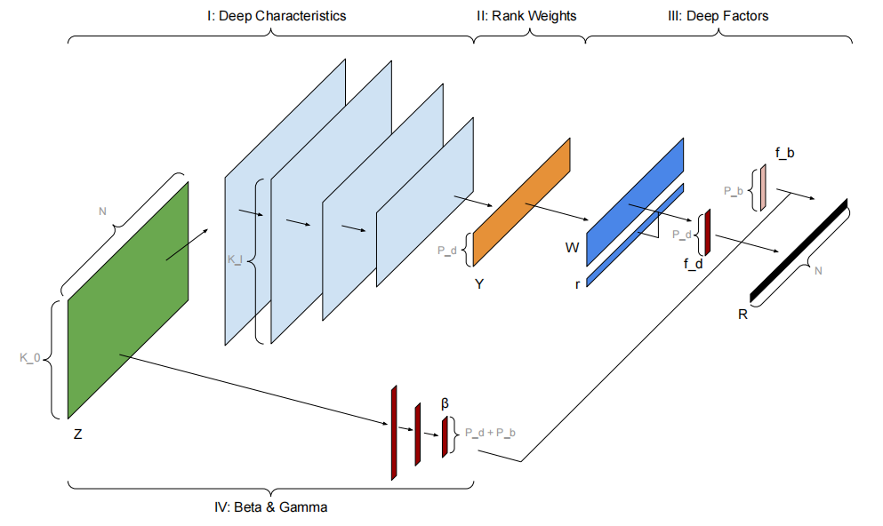
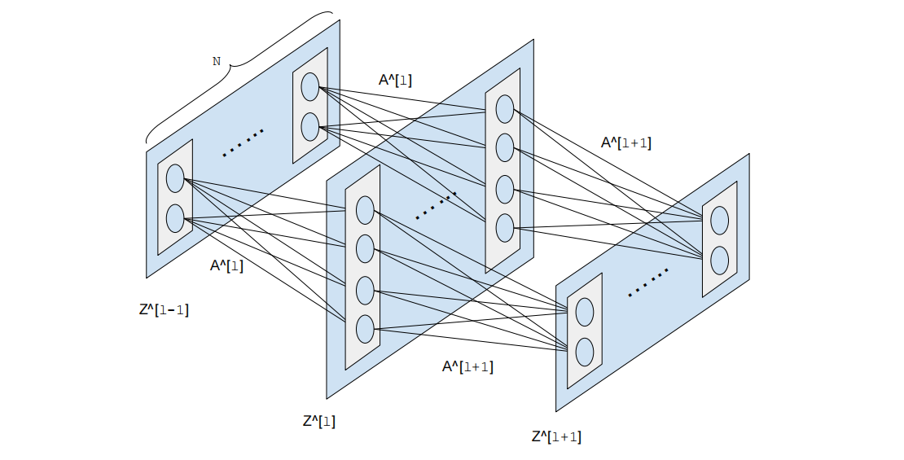
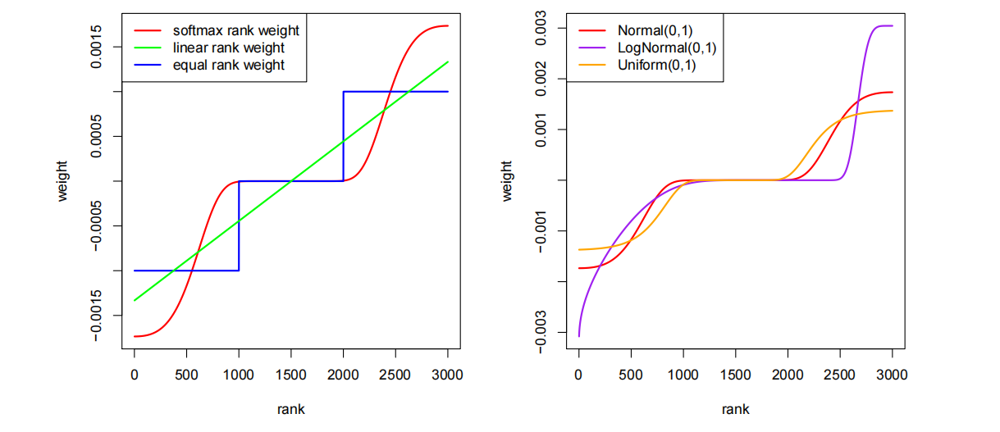

# Deep Learning in Characteristics-Sorted Factor Models

**Key Words:** Cross-sectional Returns, Deep Learning, Latent Factors, Nonlinearity,
Security Sorting.
<!-- more -->

**Autor：** Guanhao Feng, Jingyu He, Nicholas G. Polson, Jianeng Xu*

*Forthcoming, Journal of Financial and Quantitative Analysis*

## II 深度学习和实证资产定价
* II.A 已实现定价误差的资产定价优化
* II.B 特征排序因子模型的深度学习重构
* II.C 实现Fama-French模型作为特例

## II.A  资产定价优化

标准的资产定价线性因子模型基于因子风险溢价(factor risk premia)分解如下:

\begin{equation}
    E_{t-1}(r_{i,t}) = \boldsymbol{\beta}_{i,t-1}^\intercal \boldsymbol{\lambda_f}
\end{equation}

* $r_{i,t}:$ 资产 $i$ 在时间 $t$ 的超额回报
* $\boldsymbol{\beta}_{i,t-1}:$ 因子在时间 $t-1$ 更新的载荷
* $\boldsymbol{\lambda_f}:$ $K \times 1$ 因子 $\mathbf{f}_t$ 的风险溢价

任何潜在的定价误差 $\alpha_i$ 都会被添加在右侧

\begin{equation}
    E_{t-1}(r_{i,t}) = \alpha_i + \boldsymbol{\beta}_{i,t-1}^\intercal \boldsymbol{\lambda_f}
\end{equation}

??? 因子模型
    第一种因子模型可被公式描述如下：

    \begin{equation}
        \tilde{r}_{i t}=a_{i}+b_{i}^{\prime} \tilde{f}_{t}+\tilde{e}_{i t}
        \tag{1}
    \end{equation}

    * $i=1,2,\dots, N$ 代表不同的股票
    * $t = 1,2,\dots, T$ 代表不同的时段
    * $\tilde{r}_{i t}$ 代表股票 $i$ 在 $t$ 时刻的收益率

    该因子模型的含义是，股票在每一时刻的收益率可以分为三个部分：
    
    1. 不随时间改变的常数项 $a_i$。
    2. 由某个变量 $\tilde{f}$ 驱动的部分。
    3. 模型未能解释、但与 $\tilde{f}$ 无关的部分。
    
    按照Back(2010)书上的叫法，不妨将公式(1)称为**统计因子模型(statistical factor model)**， $\tilde{f}_t$ 称为因子
 
    第二种因子模型可以被公式描述如下：

    \begin{equation}
        E[\tilde{r}_{it}] = r_{ft} + b_i^\prime \lambda_t
        \tag{2}
    \end{equation}

    * $r_{ft}$ 是 $t$ 时刻的无风险利率

    该因子模型的含义是，股票在每一时刻的收益率可以分为两个部分：

    1. 无风险利率
    2. 由 $\lambda_t$ 贡献的部分(也称作风险溢价)

GRS检验。如果存在充分因子模型，那么定价误差的二次项应该在统计上和经济上都是不显著的。但是，在学术文献中并不存在这样的因子模型。

这篇文章训练了基于滞后特征的betas非线性神经网络。因此，方程(2)中总体模型为：

\begin{equation}
    \begin{split}
        r_{i,t} &= \alpha_i + \boldsymbol{\beta}_{i,t-1}^\intercal \mathbf{f}_t + \epsilon_{i,t}, \\
        \boldsymbol{\beta}_{i,t-1}^\intercal & = G(\mathbf{z}_{i,t-1})
    \end{split}
\end{equation}

其中 betas 的平行神经网络$G(\cdot )$ 是与潜在因子 $\mathbf{f}_t$ 共同学习的。III.C中有详细的函数形式。

让 $\widehat{r}_{i, t}$ 代表由交易因子 $\mathbf{f}_t$ 构造的线性投资组合去模拟资产回报 $r_{i,t}$。
$\widehat{r}_{i, t} = \boldsymbol{\beta}_{i,t-1}^\intercal \mathbf{f}_t$。若残差项 $\epsilon_{i,t}$ 的平均值为0，则截距项$\alpha_{i}$ 等于平均拟合误差 $\frac{1}{T}\sum_{t=1}^{T}\alpha_{i,t}$，其中 $\alpha_{i,t} = r_{i,t} - \widehat{r}_{i,t}$

## II.B  深度学习中的特征排序因子

为了对风险调整后的超额回报进行建模，
增强深度因子模型除了$P_b$-factor 基准模型 $\mathbf{f}_{b,t}$ 
（CAPM或Fama-French 5因子模型）之外，
还生成了 $P_d$ 深度因子 $\mathbf{f}_{d,t}$，
共同定价个股回报。
这里使用 $\mathbf{f}_t = [\mathbf{f}_{d,t}^\intercal,\mathbf{f}_{b,t}^\intercal]^\intercal$ 
表示两组因子，即深度因子和基准因子。
将已实现回报预测 $\widehat{r}_{i,t}$ 构造为 $\mathbf{f}_{d,t}$ 和 $\mathbb{f}_{b,f}$ 的无截距项的线性组合。
因此，拟合误差 $\alpha_{i,t}$，衡量了横截面和时间序列的变化。完整的模型为：

\begin{equation}
    \begin{split}
        \widehat{r}_{i,t} & = \boldsymbol{\beta}(\mathbf{z}_{i,t-1})^\intercal \mathbf{f}_t \\
            & = \boldsymbol{\beta}_d(\mathbf{z}_{i,t-1})^\intercal \mathbf{f}_{d,t} + \boldsymbol{\beta}_b(\mathbf{z}_{i,t-1})^\intercal \mathbf{f}_{b,t}, \\
        \alpha_{i,t} & = r_{i,t} - \widehat{r}_{i,t}, \\
        \mathbf{f}_{d,t} & = \mathbf{W}_{t-1} \mathbf{r}_t, \\
        \mathbf{W}_{t-1} & = H(\mathbf{Z}_{t-1}), \\
        \boldsymbol{\beta}(\mathbf{z}_{i,t-1}) & = G(\mathbf{z}_{i,t-1}),
    \end{split}
\end{equation}

* $\boldsymbol{\beta}(\mathbf{z}_{i,t-1})^\intercal = [\boldsymbol{\beta}_d(\mathbf{z}_{i,t-1})^\intercal, \boldsymbol{\beta}_b(\mathbf{z}_{i,t-1})^\intercal]$ 
是分别对应于潜在深度因子和基准因子的动态 betas 。
* $\mathbf{r}_t = (r_{1,t},\dots,r_{N,t})$ 表示月份 $t$ 时 $N$ 个股的回报向量
* $\mathbf{W}_{t-1}$ 是由月份 $t−1$ 确定的 $P_d \times N$ 矩阵，
用于 long-short 投资组合权重。
* $\mathbf{Z}_{t-1} = (\mathbf{z}_{1,t-1},\dots,\mathbf{z}_{N,t-1})$ 
是滞后公司特征的 $K_0 \times N$ 维矩阵。

目标是最小化在所有周期和资产的已实现定价误差的二次和：

\begin{equation}
    \mathcal{L}_\lambda = \sum_{i=1}^{N}\sum_{t=1}^{T_i}(r_{i,t} - \boldsymbol{\beta}(\mathbf{z}_{i,t-1})^\intercal \mathbf{f}_t)^2 + \lambda \times \text{penalty(DL)}, 
\end{equation}

## II.C  深度学习中的Fama-French 5 因子模型

<figure markdown="span">
  { width="500" }
  <figcaption>Deep Learning Network Architecture</figcaption>
</figure>

## III 深度神经网络的结构

<figure markdown="span">
  { width="500" }
  <figcaption>Deep Learning Network Architecture</figcaption>
</figure>

* III.A 揭示如何在前馈神经网络对 *[inputs]* 公司特征进行降维
* III.B 计算多空投资组合(long-short portfolio)的权重
* III.C 计算 *[intermediate features]* 深度因子
* III.D 描述优化目标，总结完整的增强深度因子模型

以时间 $t$ 为索引的典型训练观察包括以下数据类型：

* $\{r_{i,t}\}_{i=1}^N$，$N$ 只个股的超额回报
* $\{z_{k,i,t-1}:1\leq k \leq K_0\}_{i=1}^N$，$N$ 只个股的 $K_0$ 个滞后特征
* $\{f_{d,t}\}_{d=1}^{P_b}$，$P_b$ 个基准因子

## III.A  深度特征

对原始数据的特征进行降维，神经网络的 asset $i = 1,2,\dots,N$ 
和 $l$-th 层的结构如下（原始输入 *[inputs]* 为 $l = 0$ 层）：

\begin{equation*}
    \begin{split}
        \mathbf{z}_{i,t-1}^{[l]} & = F^{[l]}(A^{[l]}\mathbf{z}_{i,t-1}^{[l-1]} + b^{[l]}),\quad for \quad l = 1,2,\dots,L \\
        \mathbf{z}_{i,t-1}^{[0]} & := [z_{1,i,t-1},\dots,z_{K_0,i,t-1}]^\intercal,  
    \end{split}
\end{equation*}

* $\mathbf{z}_{i,t-1}^{[l]}$，$K_l \times N$ 矩阵 $\mathbf{Z}_{t-1}^{[l]}$ 的 $i$-th 列
* 单变量激活函数 $F(\cdot) = tanh(\cdot)$ 作用到矩阵的每一个元素上
* 神经网络的权重 $A$ 和偏差 $b$ 是这部分需要被训练的参数

\[\{(A^{[l]}, b^{[l]}):A^{l}\in \mathbb{R}^{K_l \times K_{l-1}},b^{[l]}\in \mathbb{R}^{K_l}    \}_{l=1}^L \]

与标准的深度神经网络结构不同，
每个神经元都与前一层的所有神经元完全连接，
这些变换是按列执行的，没有在不同的股票之间进行通信。
此部分中执行的所有变换都在单只股票中进行。
两个不同的股票的数据（和中间结果）是分开的，
并且不相互干扰。
这种设置允许特定个体股票的深层特征由其自身决定，
而不是由其他股票决定。
然后，根据深度特征对所有股票进行分类，
收集不同股票的信息。
实证研究发现，研究结果对激活函数的选择不敏感，
而特征的组合和转化发挥着更重要的作用。
这种多层结构总结了从原始特征到低维深度特征的信息。

\begin{align}
    \mathbf{Y}_{t-1} &:= \mathbf{Z}_{t-1}^{[L]}, \\
    \mathbf{Z}_{t-1}^{[l]} &:= F^{[l]}(A^{[l]}\mathbf{Z}_{t-1}^{[l-1]} + b^{[l]}),\quad for \quad l = 1,2,\dots,L\\
    \mathbf{Z}_{t-1}^{[0]} &:= \mathbf{Z}_{t-1}.
\end{align}

<figure markdown="span">
  { width="500" }
  <figcaption>Deep Deep Neural Network of Characteristics </figcaption>
</figure>

## III.B  排序和非线性权重

给定由公式（6）给出的深度学习结构得到的深度特征 $\mathbf{Y}_{t-1}$，可以按以下方式构造的投资组合权重 $\mathbf{W}_{t-1}$。

定义 $h^{[0]} : \mathbb{R}^N \rightarrow [-1,1]^N$ 根据深度特征的排名来计算投资组合的权重。当变量为矩阵的时候，它作用到所有行上。
让 $\mathbb{y}_{t-1} = (y_1,\dots,y_N)$ 为 $N\times 1$向量，代表1个深度特征($\mathbf{Y}_{t-1}的一行$)
权重为：

\begin{equation}
    \begin{split}
        \mathbf{W}_{t-1} = h^{[0]}(\mathbf{y}_{t-1}) &= 
            \begin{matrix}
                \text{long portfolio} \\
                \overbrace{\begin{bmatrix}
                    \text{softmax}(y_1^+)\\
                    \text{softmax}(y_2^+)\\
                    \vdots \\
                    \text{softmax}(y_N^+)
                \end{bmatrix}}
            \end{matrix}
             - 
             \begin{matrix}
                \text{short portfolio} \\
                \overbrace{\begin{bmatrix}
                    \text{softmax}(y_1^-)\\
                    \text{softmax}(y_2^-)\\
                    \vdots \\
                    \text{softmax}(y_N^-)
                \end{bmatrix}}
            \end{matrix},\\
            \text{where} y^+ :&= -50e^{-5y},\quad y^- := -50e^{5y},\\
            \text{softmax}(y_i) &=\frac{e^{y_i}}{\sum_{i=1}^{N}e^{y_i}}.
    \end{split}
\end{equation}

<figure markdown="span">
  { width="500" }
  <figcaption>Comparison: Weight vs. Rank </figcaption>
</figure>

III.A和III.B共同说明了从滞后特征 $\mathbf{Z}_{t−1}$ 到个体资产权重$\mathbf{W}_{t-1}$的深度学习变换。为了简单起见，将该变换记为

\begin{equation}
    \mathbf{W}_{t-1} = H(\mathbf{Z}_{t-1})
\end{equation}

## III.C  深度因子和非线性动态betas

本小节继续构建基于long-short投资组合权重
$\mathbf{W}_{t-1}$的深度因子，
然后构建一个用于资产定价的增强的深度因子模型。
我们需要个股回报和相应的权重来创建long-short因子。
该模型的第一个 $L$ 层生成深度特征。
再接1层去生成投资组合权重$\mathbf{W}_{t-1}$，如下：

\begin{equation}
    \begin{split}
        \mathbf{W}_{t-1} & := \text{Input frome Equation(9)} \\
        \mathbf{f}_{b,t} & := \mathbf{W}_{t-1} \mathbf{r}_t \\
        \widehat{r}_{i,t} & := \boldsymbol{\beta}(\mathbf{z}_{i,t-1})^\intercal \mathbf{f}_t = \boldsymbol{\beta}_d(\mathbf{z}_{i,t-1})^\intercal \mathbf{f}_{d,t} + \boldsymbol{\beta}_b(\mathbf{z}_{i,t-1})^\intercal \mathbf{f}_{b,t}
    \end{split}
\end{equation}

目前关于条件因子模型的文献主要采用了线性函数形式来表示公司特征上的贝塔系数。
本框架提供了一种内部一致的beta建模。
具体来说，假设beta遵循一个在同一组高维特征上的神经网络结构
来训练深度特征。

\begin{equation}
    [\boldsymbol{\beta}_d(\mathbf{z}_{i,t-1})^\intercal, \boldsymbol{\beta}_b(\mathbf{z}_{i,t-1})^\intercal]^\intercal = G(\mathbf{z}_{i,t-1})
\end{equation}

将beta神经网络与因子神经网络联合训练，
最小化损失函数。

## III.D  最小化损失函数

\begin{equation}
    \mathcal{L}_\lambda(\widehat{\Theta }) := \frac{1}{NT}\sum_{t=1}^{T}\sum_{i=1}^{N}(r_{i,t}-\widehat{r}_{i,t})^2 + \lambda\sum_{l=1}^{L-1}\sum_{i\neq j}|A_{i,j}^{[l]}|,
\end{equation}

* $\widehat{\Theta }$ 神经网络中所有参数

\begin{equation}
    \begin{split}
        &\widehat{r}_{i,t} = \boldsymbol{\widehat{\beta}}_d(\mathbf{z}_{i,t-1})^\intercal \mathbf{f}_{d,t} + \boldsymbol{\widehat{\beta}}_b(\mathbf{z}_{i,t-1})^\intercal \mathbf{f}_{b,t}\\
        &[\boldsymbol{\widehat{\beta}}_d(\mathbf{z}_{i,t-1})^\intercal, \boldsymbol{\widehat{\beta}}_b(\mathbf{z}_{i,t-1})^\intercal]^\intercal = G(\mathbf{z}_{i,t-1})
    \end{split}
\end{equation}

\begin{equation}
    \widehat{\Theta } = \text{arg min}\mathcal{L}_\lambda
\end{equation}